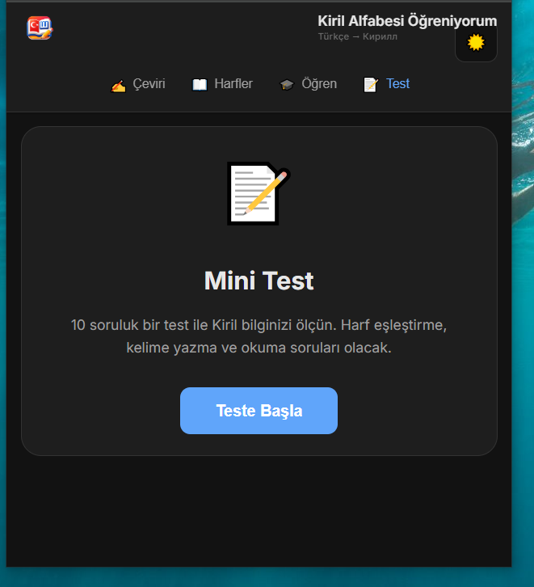
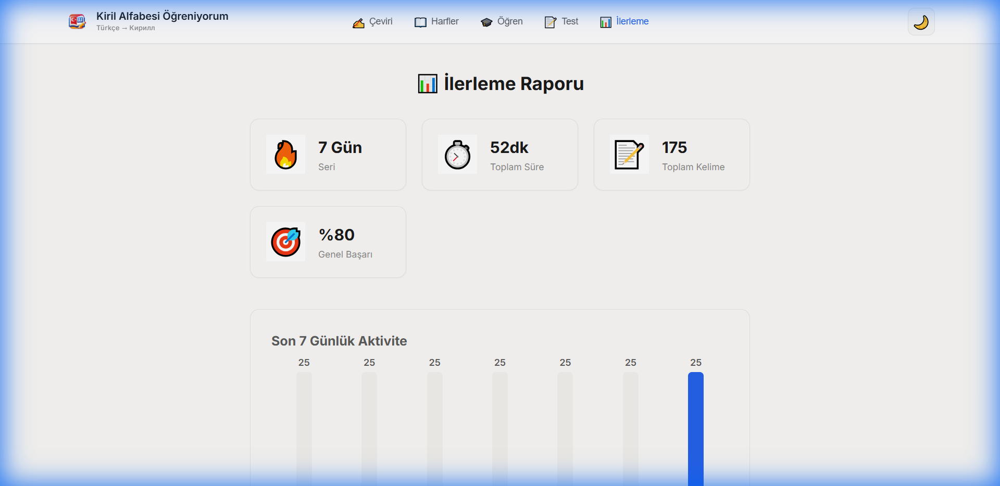
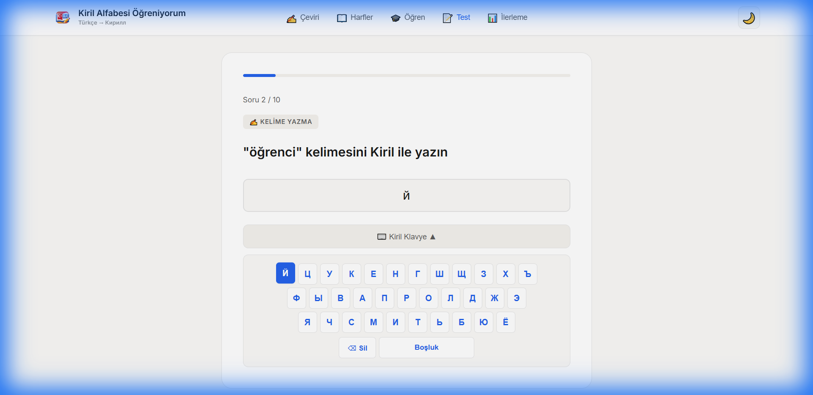
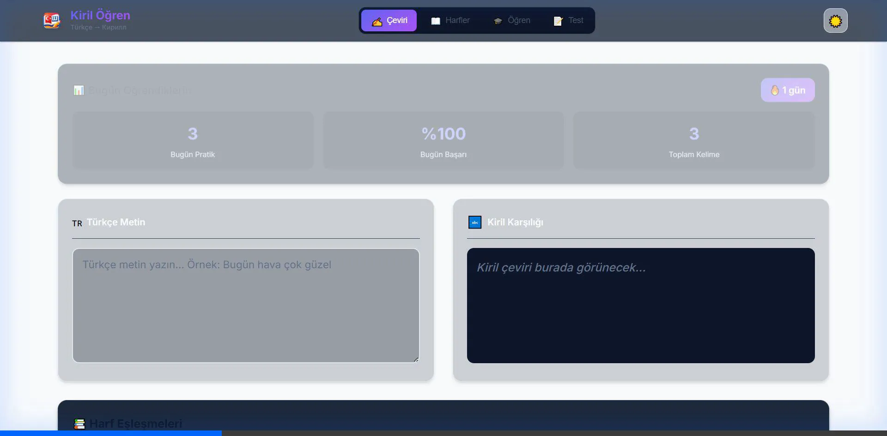

# Kiril Alfabe Öğrenme Uygulaması 🇹🇷🇧🇬

Modern, etkileşimli ve kapsamlı bir Kiril alfabesi öğrenme platformu. React ile geliştirilen bu uygulama, kullanıcıların Kiril alfabesini kolayca öğrenmelerini, pratik yapmalarını ve ilerlemelerini takip etmelerini sağlar.



## 🌟 Özellikler

### 1. Çeviri ve Pratik (Transliteration Area)
Ana öğrenme alanı. Türkçe cümleleri Kiril alfabesiyle yazmaya çalışın.
- **Anlık Doğrulama:** Yazdığınız her harfi kontrol eder ve hata yaptığınızda hemen geri bildirim verir.
- **Sanal Klavye:** Kiril karakterleri için ekranda sanal bir klavye bulunur.
- **Harf Tablosu:** Takıldığınızda "📖 Harfler" butonu ile global harf tablosuna ulaşabilirsiniz.

### 2. Gelişmiş İlerleme Analizi
Gelişiminizi detaylı grafikler ve istatistiklerle takip edin.
- **Günlük Özet:** Ana sayfada o günkü kelime sayınızı ve sürenizi görün.
- **Detaylı İlerleme Sayfası:** Son 7 günlük performansınızı, toplam çalışma sürenizi ve başarı oranınızı analiz edin.
- **Otomatik Süre Takibi:** Uygulamada aktif geçirdiğiniz süreyi otomatik olarak hesaplar.



### 3. Test Modu & Klavye Desteği
Öğrendiklerinizi test edin.
- **Çoktan Seçmeli:** Kiril -> Latin veya Latin -> Kiril eşleştirme.
- **Kelime Yazma:** Size verilen Türkçe kelimenin Kiril karşılığını yazın. Sanal klavye bu modda otomatik olarak açılır.
- **Sesli Geri Bildirim:** Doğru ve yanlış cevaplarda sesli uyarılar.



### 4. Öğrenme Modu (Flashcards)
Yeni kelimeler öğrenmek için tasarlanmış kart sistemi.
- **İlerleme Çubuğu:** Setin ne kadarını tamamladığınızı görün.
- **Enter Desteği:** Hızlı pratik için klavye kısayolları (Enter ile geçiş).

### 5. Mobil Uyumlu Tasarım
Her cihazda mükemmel deneyim.
- **Responsive Header:** Mobilde kompakt, masaüstünde geniş görünüm.
- **Global Çekmece:** Harf tablosuna her yerden kolay erişim.



## 🚀 Kurulum

Projeyi yerel makinenizde çalıştırmak için:

1.  Repoyu klonlayın:
    ```bash
    git clone https://github.com/gorkembayraktar/kirilalfabesi.git
    cd kirilalfabesi
    ```

2.  Bağımlılıkları yükleyin:
    ```bash
    npm install
    ```

3.  Uygulamayı başlatın:
    ```bash
    npm run dev
    ```

4.  Tarayıcınızda `http://localhost:5173` adresine gidin.

## 🛠 Teknolojiler

-   **React** (Vite ile)
-   **CSS3** (CSS Variables, Flexbox, Grid)

## 📝 Lisans

Bu proje MIT lisansı ile lisanslanmıştır.
